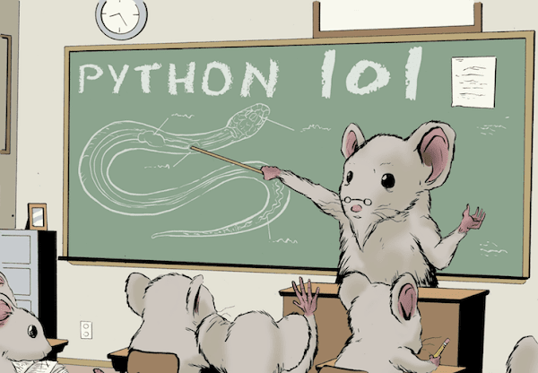

# python101

> Exercícios para fixação de sintaxe Python.

<p align=center>
  
</p>

### Referências:
- [Introdução ao Python - Microsoft Learn](https://docs.microsoft.com/pt-br/learn/modules/intro-to-python/)
- [Python Oficial](https://docs.python.org/pt-br/3/tutorial/index.html)
- [PensePython2e](https://penseallen.github.io/PensePython2e/01-jornada.html)
- [Python para Zumbis - YouTube](https://www.youtube.com/c/PythonparaZumbis/playlists)
- [PythonClub](http://pythonclub.com.br/)

<hr>

**Exercício 01:** Crie uma função que receba dois números e retorne o maior deles.

**Exercício 02:** Calcule a média aritmética dos valores contidos em uma lista.

**Exercício 03:** Faça um programa que, dado um valor n qualquer, tal que n > 1, imprima na tela um quadrado feito de asteriscos de lado de tamanho n. Por exemplo:
```python
n = 5

*****
*****
*****
*****
*****
```

**Exercício 04:** Crie uma função que receba uma lista de nomes e retorne o nome com a maior quantidade de caracteres. Por exemplo, para ["José", "Lucas", "Nádia", "Fernanda", "Cairo", "Joana"], o retorno deve ser "Fernanda".

**Exercício 05:** Considere que a cobertura da tinta é de 1 litro para cada 3 metros quadrados e que a tinta é vendida em latas de 18 litros, que custam R$ 80,00. Crie uma função que retorne dois valores em uma tupla contendo a quantidade de latas de tinta a serem compradas e o preço total a partir do tamanho de uma parede (em m²).

**Exercício 06:** Crie uma função que receba os três lado de um triângulo e informe qual o tipo de triângulo formado ou "não é triangulo", caso não seja possível formar um triângulo.

**Exercício 07:** Dada uma lista, descubra o menor elemento. Por exemplo, [5, 9, 3, 19, 70, 8, 100, 2, 35, 27] deve retornar 2.

**Exercício 08:** Faça um programa que, dado um valor n qualquer, tal que n > 1, imprima na tela um triângulo retângulo com n asteriscos de base. Por exemplo, para n = 5 o triângulo terá 5 asteriscos na base:
```python
n = 5

*
**
***
****
*****
```

**Exercício 09:** Crie uma função que receba um número inteiro N e retorne o somatório de todos os números de 1 até N. Por exemplo, para N = 5, o valor esperado será 15.


**Exercício 10:** Um posto está vendendo combustíveis com a seguinte tabela de descontos:
```python
  Álcool:
    - Até 20 litros, desconto de 3% por litro;
    - Acima de 20 litros, desconto de 5% por litro.
  Gasolina:
    - Até 20 litros, desconto de 4% por litro;
    - Acima de 20 litros, desconto de 6% por litro.
```
